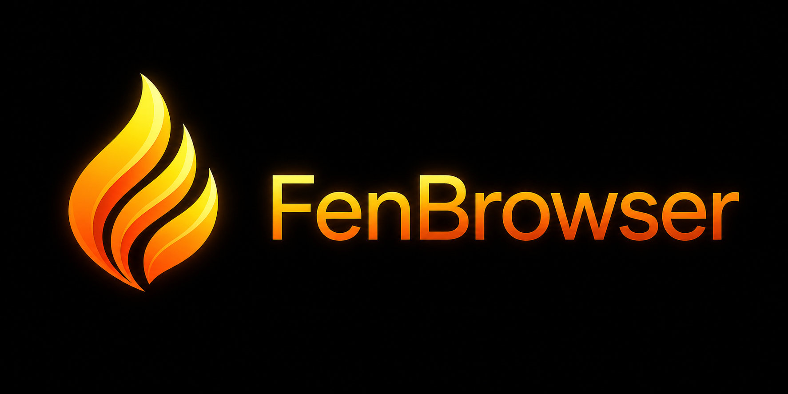

  

  
  
  
  
  

# 🦊 FenBrowser

**A ground-up, standards-driven web browser engine written entirely in C#.**

FenBrowser is an experimental browser engine that implements the web platform from scratch — HTML parsing, CSS cascade & layout, GPU-accelerated rendering, and a custom ECMAScript runtime — all in modern .NET, without wrapping Chromium, WebKit, or Gecko.

> [!NOTE]
> **This is a research & learning project.** FenBrowser is not a daily-driver browser. Many websites won't render correctly (or at all) yet. We're building this to deeply understand the modern web stack, not to replace your current browser.
